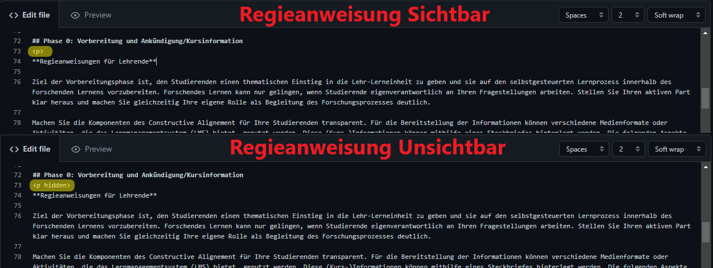
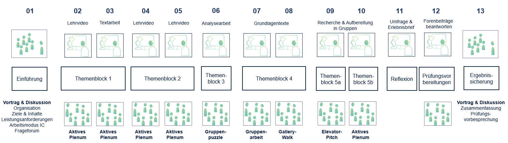

<!--
author:   twillo

email:    support.twillo@tib.eu

version:  1.0.0

language: de

narrator: Stina Schäfer, Lennart Rosseburg

comment:  Die didaktische Vorlage Inverted Classroom von <b>[twillo](https://twillo.de/)</b> ist lizenziert unter der <b>[Lizenz CC 0 (1.0)](https://creativecommons.org/publicdomain/zero/1.0/legalcode)</b>. Ausgenommen von der Lizenz sind explizit anders gekennzeichnete Elemente. <b>Das GitHub-Repository zu diesem Kurs finden Sie <b>[hier](https://github.com/twillo-lehre-teilen/Template_InvertedClassroom)</b>.

mode:     Presentation

link:     

script:   
-->
<!--
  Einstellung der Sichtbarkeit von Regieanweisungen:
  - Die Regieanweisungen befinden sich direkt zu Beginn jeder Phase und sind umklammert von HTML p-tags (Bsp.: 
...Regieanweisung...
)
  - Um die Sichtabrkeit zu ändern muss lediglich das Wort "hidden" dem vorangehenden p-tag hinzugefügt bzw. entfernt werden.
  - d.h.: 
        ...Regieanweisung... 
   == Sichtbar innerhalb des LiaScript Kurses
          
 ...Regieanweisung... 
   == Unsichtbar innerhalb des LiaScript Kurses
  - Die Regieanweisungen bleiben immer sichtbar innerhalb von GitHub!
-->

# Template - Inverted Classroom

<!--  style = "background-color: #F0F2F6; color:black; padding: 10px 10px 5px 10px; margin-bottom: 10px" -->

**Lizenzhinweis**

<!-- style = "text-align:center;" -->
Die didaktische Vorlage Inverted Classroom von [twillo](https://twillo.de/) ist lizenziert unter der [Lizenz CC 0 (1.0)](https://creativecommons.org/publicdomain/zero/1.0/legalcode). Ausgenommen von der Lizenz sind explizit anders gekennzeichnete Elemente. 
<b>Das GitHub-Repository zu diesem Kurs finden Sie [hier](https://github.com/twillo-lehre-teilen/Template_InvertedClassroom).</b>

- [Informationen für Lehrende](#2)

  - [Was versteht man unter Inverted Classroom?](#2)
  - [Hinweise zur Nutzung des Templates](#3)

- [Kursinformation](#4)
- [Einstiegsphase](#5)
- [Themenblock 1](#6)
- [Evaluation](#7)
- [Prüfungsvorbereitung](#8)
- [Prüfung](#9)
- [Abschlussphase/Ergebnissicherung](#10)

-------------
Die Kursvorlage zählt aufgrund ihrer Lizenz zu den **Open Educational Resources (OER)**. Möchten auch Sie einen Beitrag zur offenen Hochschullehre leisten? Teilen Sie Ihre Lehrmaterialien auf dem OER-Portal twillo (gefördert durch das Nds. Ministerium für Wissenschaft und Kultur).

Sie haben Fragen zu OER im Allgemeinen oder zu diesem Template? Gern steht Ihnen das twillo-Team zur Verfügung. Sie erreichen uns via E-Mail an (mailto:support.twillo@tib.eu).

##  Was versteht man unter Inverted Classroom?
---
Inverted Classroom ist ein spezifisches Lehr- und Lernkonzept des Blended Learning. Im Kern geht es darum, einer synchron stattfindenen Plenumssitzung eine asynchrone Selbstlernphase vorzuschalten. Die Inhaltserschließung erfolgt als asynchrone Selbstlernphase über ausgewählte und bereitgestellte bzw.  selbst erstellte Lehr- und Lernmaterialien. Mittels der Materialien eignen sich die Studierenden im Rahmen des Selbststudiums die Inhalte individuell und entsprechend ihres Lerntempos (und ggf. auch -niveaus) an. Die Phase der Inhaltsvertiefung findet in Präsenz bzw. in einem synchronen Setting statt. Sie wird von der Lehrperson moderiert  durch geeignete Lehrmethoden, die die Interaktivität der Studierenden fördern, didaktisch aufbereitet.

**Gelingensbedingungen für die Umsetzung**

Für die Gestaltung und Umsetzung des Inverted Classroom Konzepts gibt es für beide Phasen zentrale Anforderungen, die Lehrende bei der Planung beachten sollten: Während für die asynchrone Selbstlernphase primär die Auswahl der bereitzustellenden Materialien im Vordergrund steht, gilt es für die Planung der synchronen Lehr- Lernsettings stärker darum, didaktisch-methodische Abläufe für das Vertiefen, Routinisieren, Anwenden etc. zu bestimmen. Folgende zentrale Anforderungen sind zu beachten:

**Bereitstellung der Materialien für die asynchrone Selbstlernphase**

Bei der Bereitstellung von Inhalten liegt die Besonderheit einerseits auf einer *zielgruppenbezogenen* und andererseits auf einer *lernzielorientierten* Auswahl der Materialien. Dies setzt voraus, dass die gesamte Lehrveranstaltung thematisch in Einheiten sequenziert und mit konkreten Lernzielen versehen wird. Ausgehend von den Lernzielen werden für jede Einheit entweder Materialien ausgewählt oder für die Lerngruppe neu erstellt. Um beide Kriterien (Zielgruppenangemessenheit und Lernzielorientierung) zu erfüllen, eignen sich sowohl selbst erstellte Materialien als auch für den eigenen Lehrkontext angepasste Materialien Dritter. Gerade offene Bildungsmaterialien (OER) sind dafür prädestiniert, Anpassungen am Material vorzunehmen und somit auf die Bedürfnisse der eigenen Lerngruppe einzugehen.

Der selbstgesteuerte Lernprozess der Studierenden im Rahmen der asynchrone Selbstlernphase erfordert ein ein hohes Maß an Lernmotivation sowie einen routinierten Umgang mit Methoden und Techniken des Lernens (vgl. Handke 2017: 61). Um Studierenden in dem Prozess zu unterstützen und anzuleiten, sollten die bereitgestellten Inhalte zusätzlich einen instruktiven Charakter besitzen. Materialien werden also nicht allein zum Rezipieren (lesen, anschauen, anhören) bereitgestellt, sondern sind bestenfalls mit einer Aufgabe bzw. Aktivität verknüpft. Förderlich für den individuellen Lernprozess ist deshalb die zusätzliche Bereitstellung von Aufträgen, die den Lernprozess strukturieren, als Vorbereitung für das synchrone Lehr-Lernsetting dienen oder als Lernerfolgsüberprüfung konzipiert sind. Die Lernergebnisse der asynchronen Selbstlernphase können in jedem Fall auch den Ausgangspunkt des synchronen Lehr- Lernsettings bilden.

**Gestaltung des synchronen Lehr-/Lernsettings**

In der synchronen Vertiefungsphase steht die didaktisch-methodische Gestaltung im Vordergrund. Die Steuerung erfolgt begleitend durch die Lehrperson (vgl. ebd. 61). Die Vertiefungsphase zielt auf ein kollaboratives, interaktives und kommunikatives Zusammenwirken der Lerngruppe. Mit Blick auf die formulierten Lernziele werden nun Situationen des gemeinsamen Austausches arrangiert, in denen das zuvor in digitalen Selbstlernphasen erworbene Wissen etwa durch (Re-)Thematisierung, (Re-)Kontextualisierung oder konkrete Anwendungsbezüge gefestigt  wird. Nachdem also für die asynchrone Selbstlernphase auf das Was (Inhalte) geschaut wurde, muss nun in der synchronen Vertiefungsphase dieses *Was* mit dem *Wie* verknüpft werden: die Lernergebnisse der Studierenden müssen nun von der Lehrperson verknüpft durch geeignete Methoden abgeholt werden.

*  Wie fördere ich den Austausch über das Gelernte?
*  Wie initiiere ich die aktive Auseinandersetzung mit den Inhalten?
*  Wie motiviere ich die Studierenden die Inhalte anzuwenden?
*  Wie erzeuge ich kooperative und kollaborative Lernarrangements?
*  Wie trainiere ich fachbezogene Fertigkeiten und Fähigkeiten?
*  Wie sichere ich Lernergebnisse?

In unserem [Methodenglossar](https://twillo-lehre-teilen.github.io/Methodenglossar/#/./) finden Sie hierfür verschiedene Methoden.

-----------------------

**Literatur**

*__Arnold, P./Kilian, L./Thillosen, A./Zimmer, G. (2018):__ E-Learning Handbuch. Lehren und Lernen mit digitalten Medien. Bielefeld.*

*__Dainton, N. (2018):__ Feedback in der Hochschullehre. Bern.*

*__Handke, J. (2017):__ Handbuch Hochschullehre Digital. Leitfaden für eine moderne und mediengerechte Lehr. Baden-Baden.*

*__den Ouden, H./Rottlaender, E.-M. (2017):__ Hochschuldidaktik in der Praxis: Lehrveranstaltungen planen. Ein Workbook. Opladen, Toronto.*

*__Ruhr-Universität Bochum (o.J.):__ Inverted Classroom. Lehre Laden. Downloadcenter für inspirierte Lehre, abrufbar unter: https://dbs-lin.ruhr-uni-bochum.de/lehreladen/e-learning-technik-in-der-lehre/inverted-classroom/was-ist-inverted-classroom/ (26.07.2021).*

*__Schäfer, A. M. (2012):__ Das Inverted Classroom Model. In: Handke, J./Sperl, A. (Hrsg.): Das Inverted Classroom Model: Begleitband Zur Ersten Deutschen ICM-Konferenz. Münster, Oldenburg.*

## Hinweise zur Nutzung des Templates
---
Die konkrete Ausgestaltung des Inverted Classroom Konzepts kann sehr unterschiedlich erfolgen und hängt in erster Linie von den Lehr-/Lerninhalten ab, kann sich aber auch aus der jeweiligen Lehrveranstaltung selbst und deren curricularen Rahmenbedingungen ergeben. Mit dem **Template Inverted Classroom** wird der Versuch unternommen, wesentliche Strukturmerkmale - insbesondere die Phasenanordnung - in eine flexibel nutzbare Vorlage zu überführen. Es ist ein Angebot für die eigene Lehrgestaltung und eine Strukturierungshilfe bei der Lehrplanung. Das Template steht unter einer offenen Lizenz (CC 0), sodass die Anordnung verändert, Phasen herausgenommen oder weitere Elemente ergänzt werden können.

Das Template Inverted Classroom besteht aus einem **Infobereich für Lehrende** (Was ist Inverted Classroom, Hinweise zur Nutzung), einem Bereich für die **Kursinformationen**, einem Bereich für die **Einstiegsphase** sowie zehn **Themenblöcken** für thematische Einheiten, in denen Abschnitte für asynchrone Selbstlernphasen und für synchrone Lehr-Lernsettings eingerichtet sind. Im **Themenblock 1** sind sowohl für die asynchrone Selbstlernphase als auch für die sychronen Lehr-Lernsettings Beispiele für die konkrete Ausgestaltung hinterlegt. Diese dienen lediglich als Impulse bzw. Ideenpool und müssen von Lehrenden entlang der eigenen Lehr- und Lernziele sowie Lehrinhalte konkretisiert werden. Des Weiteren sind auch Bereiche für **Evaluations- oder Reflexionszwecke**, für **Prüfungsvorbereitungen** bzw. **Prüfungen** sowie einem Bereich für die **Abschlussphase** vorangelegt.

Für die Umsetzung empfiehlt es sich, die Lehrveranstaltung in logische Sinneinheiten (Kapitel) zu unterteilen. Jede Einheit erhält ein oder mehrere Lernziele, die auch den Studierenden transparent dargelegt werden. Des Weiteren erhält jede Einheit zwei Unterbereiche, für die asynchrone Selbstlernphase (1) und das synchrone Lehr-/Lernsetting (2). Für die asynchrone Selbstlernphase werden digital vorliegende Materialien ausgewählt und im dafür vorgesehenden Bereich abgelegt. Unterhalb dieses Abschnittes können Vorbereitungen für das synchrone Lehr-Lernsetting - etwa der Sitzungsplan und kollaborative und kooperative Elemente - hinzugefügt werden oder Ergebnisse, die aus der synchronen Vertiefungsphase hervorgehen (Foto des Tafelbild, Foto von Flipcharts, Protokolle, Zentrale Ergebnisse, etc.), bereitgestellt werden.

**Schritte für eine Nachnutzung:**

1. Um diese LiaScript-Vorlage nachnutzen zu können benötigen Sie einen kostenlosen GitHub-Account. Besitzen Sie schon einen GitHub-Account können Sie mit Schritt 2 fortfahren. Falls Sie noch keinen Account bei GitHub besitzen erstellen Sie sich zunächst einen. [Hier gehts zur Anmeldung](https://github.com/).
2. Erstellen Sie nun ein neues Repository für Ihren eigenen Kurs. Zum importieren dieser Vorlage wählen Sie beim erstellen des Repositories die Option **"Import a repository"** aus. Gebe Sie als URL folgendes an: [https://github.com/twillo-lehre-teilen/Template_InvertedClassroom.git](https://github.com/twillo-lehre-teilen/Template_InvertedClassroom.git). Desweiteren sollten Sie ihrem Repository einen prägnanten Titel für Ihren Kurs geben und es auf **"public"** stellen, damit LiaScript daraus einen Kurs generieren kann.
3. Prüfen Sie nach dem Import, ob die Strukturen und Inhalte der Vorlage korrekt vorhanden sind.
4. Zum generieren des Kurses besuchen Sie die [LiaScript-Website](https://liascript.github.io/). Fügen Sie hier die URL zur **Kursdatei (.md)** innerhalb des Repositories ein und klicken Sie auf **"Load Course"**. Ihr Kurs ist jetzt erstellt und erreichbar über der von LiaScript generierten URL.
5. Nun können Sie innerhalb der Markdown-Datei (.md) die Inhalte jeder einzelnen Phase anpassen oder ergänzen. Alle Veränderungen werden dabei automatisch von LiaScript übernommen (Dies kann allerdings einige Minuten dauern). Um das Bearbeiten und Verändern des Kurses zu vereinfachen empfehlen wir Ihnen die Nutzung des **Texteditor Atom** in Verbindung mit dem **LiaScript Plugin** "liascript-preview"
6. Denken Sie daran, die Regieanweisungen entweder zu löschen oder unsichtbar zu machen. Das Template ist so konzipiert, dass die Regieanweisungen für Lehrende innerhalb des LiaScript Kurses zunächst für jeden sichtbar sind. Möchten Sie dies ändern, sodass die Regieanweisungen innerhalb des LiaScript Kurses für jeden unsichtbar sind, so müssen Sie die Sichtbarkeit der Regieanweisungen in jeder Phase des Lernmoduls in der Kursdatei (.md) anpassen. Die Regieanweisungen finden Sie zu Beginn jeder Lernmodul Phase, sie sind jeweils umklammert von HTML p-tags. Um die Regieanweisungen unsichtbar zu machen muss das Wort "**hidden**" dem vorangehenden p-tag hinzugefügt werden. Der unten zu sehende Screenshot zeigt wie dies innerhalb der Kursdatei (.md) aussehen würde.
7. Überprüfen Sie vor der Freigabe des Kurses, ob die Sichtbarkeit in allen Lernmodul Phasen entsprechend Ihren wünschen eingestellt ist.

<!-- style = "text-align:center;" -->

## Kursinformationen
---

<!--  style = "border: 3px solid #880000; background-color: #FAFAFC; color:black; padding: 10px 10px 5px 10px; margin-bottom: 10px" -->

**Regieanweisungen für Lehrende**

In diesem Bereich werden alle kursrelevanten Informationen für die Studierenden hinterlegt. Ziel ist es, dass Studierende sich in die sowohl organisatorische als auch thematische Ausrichtung Ihres Kurses einlesen und einstimmen können. Inverted Classroom kann nur gelingen, wenn Studierende Verantwortung für ihren eigenen Lernprozess übernehmen und ein verstärktes Bewusstsein für die eigenen Lernfortschritte entwickeln. Stellen Sie also ihren aktiven Part klar heraus und machen Sie gleichzeitig Ihre eigene Rolle als Lernprozessbegleiter:in deutlich. (Sie können hierfür den Foliensatz Inverted Classroom nutzen, der das Prinzip des Lehr- und Lernkonzepts vorstellt.)

Machen Sie die Komponenten des Constructive Alignement für Ihre Studierenden transparent. Für die Bereitstellung der Informationen können verschiedene Formate und Aktivitäten, die das Lernmanagementsystem (LMS) bietet, genutzt werden. Die KursInformationen können mithilfe eines Steckbriefs hinterlegt werden. Folgende Aspekte können in dem Steckbrief aufgeführt werden.

**Inhalte & Schwerpunkte**

Benennen Sie hier die Inhalte und Schwerpunkte Ihrer Veranstaltung. Diese können mit den inhaltlichen Zielen kombiniert oder verfeinert werden. Formulieren Sie die Lernziele so, dass erkenntlich wird, welches Wissen oder welche Kompetenzen nach Abschluss der Veranstaltung erworben sein sollten. Die Ziele können zum Beispiel in einfache prägnante Sätzen gefasst werden oder als Aufzählung angeordnet werden. Zentral ist, dass Sie von den formulierten Lernzielen die Inhalte ableiten.

Weiterführende Literatur zum Constructive Alignment finden Sie hier:

*  https://wb-web.de/material/methoden/lernziele-formulieren-leicht-gemacht.html
*  https://www.uni-konstanz.de/typo3temp/secure_downloads/58441/0/8428a16dc328025efae548d1f1dac89affe646af/Handreichung_Kompetenzorientiert_Pruefen_Konstanz.pdf

**Prüfungsform, Leistungsnachweise & Kriterien**

Damit die Studierenden einschätzen können, welche Leistungen sie am Ende Ihrer Veranstaltung erbringen müssen, hinterlegen Sie die Anforderungen. Benennen Sie hierfür die Prüfungsform und worin die Prüfung besteht. Welche Produkte müssen die Studierenden einreichen? Machen Sie durch die Bereitstellung von Informationen oder Hilfsmitteln transparent, welche Kriterien Sie zur Bewertung heranziehen. Beispiel: Fordern Sie von den Teilnehmenden einen Essay zu schreiben, so stellen Sie möglichst eine Vorlage oder ein Best-Practice-Beispiel als Orientierungshilfe bereit.

-----------------------------------------

**In dieser Übersicht erhalten Sie alle kursrelevanten Informationen zur Lehrveranstaltung:**
=============================================================================================

<!--  style = "background-color: #F0F2F6; color:black; padding: 10px 10px 5px 10px; margin-bottom: 10px" -->

  **Inhalte & Schwerpunkte der Veranstaltung:** 
  **Lernziele: **
  **Prüfungsform & Leistungsnachweise:** 
  **Hinweise zu den Bewertungskriterien:** 
  **Semesterfahrplan mit Grobplanung der Veranstaltung** 
  **Fahrplan** 

  <!--  style = "color:red;" -->
  - [Vorlage Veranstaltungsübersicht](https://www.twillo.de/edu-sharing/components/render/e594fab0-e732-4aca-9e9f-04c531349f23)

<!--  style = "background-color: lightblue; color:black; padding: 10px 10px 5px 10px; margin-bottom: 10px" -->

✎ **Arbeitsauftrag:**

**Schauen Sie sich den Fahrplan an und notieren Sie Aspekte, die Ihnen zu den Inhalten und zur Organisation einfallen. Sie können sich an folgenden Leitfragen orientieren:**

*  Mit welchen Stichworten zu den Inhalten können Sie bereits etwas anfangen?
*  Was ist Ihnen bereits aus anderen Kursen bekannt?
*  Was ist neu für Sie?
*  Gibt es Themen oder Aspekte die fehlen?

Bearbeiten Sie diesen Arbeitsauftrag bis zur ersten gemeinsamen Sitzung.

## Einstiegsphase
---
<!--  style = "border: 3px solid #880000; background-color: #FAFAFC; color:black; padding: 10px 10px 5px 10px; margin-bottom: 10px" -->

**Regieanweisungen für Lehrende**

Ziel dieser Phase ist es, den Studierenden den organisatorischen Ablauf und damit verbundenen Erwartungen transparent zu machen sowie einen inhaltlichen Einstieg in den Kurs und deren thematische Ausrichtung zu ermöglichen.

Diese Phase findet in einer gemeinsamen Sitzung statt: In Präsenz oder digital als Videokonferenz. Im Folgenden werden drei zentrale Strukturierungsaspekte für die Einstiegsphase vorgestellt.

**(1) Organisatorische Kursinformation**

In dieser Einstiegsphase werden die bereitgestellten Kursinformationen vorgestellt und gegenseitige Erwartungen geklärt. Nutzen Sie Ihre individuelle Kursübersicht als Visualisierungshilfe. Die kann unterschiedlich gestaltet sein:

*  Advance Organizer
*  Stationen des Lernens
*  Tabellarische Veranstaltungsübersicht

**Thematisierung von Prüfungen und Leistungsnachweisen**

Da die Studierenden durch die bereitgestellten Kursinformationen bereits über zu erbringende Leistungsnachweise und Prüfungen informiert sind, könnte ein Forum mit Fragen eingerichtet werden. Dies hat den Vorteil, dass Sie nicht immer die gleichen Fragen per Mail beantworten müssen. Außerdem profitieren alle Teilnehmenden von den Fragen anderer.

**Vorlage für Advance Organizer**

Eine Übersicht für einen wöchentlich stattfindenden Kurs im Inverted Classroom Konzept (inkl. Beispiel-Übersicht Theorien Sozialer Arbeit) finden Sie im OER-Portal twillo unter diesem Link: [https://www.twillo.de/edu-sharing/components/render/07e79401-7365-443c-a04a-8e90a22507d7/](https://www.twillo.de/edu-sharing/components/render/07e79401-7365-443c-a04a-8e90a22507d7/)

**(2) Seminarstruktur**

In der Einstiegsphase sollte auch das didaktische Vorgehen thematisiert werden.

Für das Lernen im Inverted Classroom Konzept ist es erforderlich, dass Studierende Verantwortung für ihren eigenen Lernprozess übernehmen. Die im Konzept verankerten asynchronen Selbstlernphasen dienen dabei der individuellen Wissensaneignung. Die Bedeutung und die Gelingensbedingungen des Selbststudiums müssen den Studierenden bewusst gemacht werden, da die Phase die zentrale Voraussetzung bildet, um erfolgreich an den synchron stattfindenen Lehr-/Lernsettings teilzunehmen. Stellen Sie der Lerngruppe das Konzept des Inverted Classrooms vor und verdeutlichen Sie die Anforderungen.

Hierfür können Sie den Foliensatz Inverted Classroom nutzen: Sie finden den Foliensatz unter diesem Link: [https://www.twillo.de/edu-sharing/components/render/c48e52d1-0bf0-4a16-96cb-4e4cc0f0f6ce/](https://www.twillo.de/edu-sharing/components/render/c48e52d1-0bf0-4a16-96cb-4e4cc0f0f6ce/)

Der Foliensatz ist darauf ausgerichtet, Studierende auf die Lehrveranstaltung vorzubereiten. Inverted Classroom erfordert ein hohes Maß an Lernmotivation und Eigenverantwortung im Hinblick auf das selbstgesteuerte Lernen (vgl. Handke 2017: 61) und sollte deshalb zu Beginn der Lehrveranstaltung thematisiert werden. In einem vorangelegten Foliensatz wird die Grundidee des Lehr- und Lernkonzepts beschrieben und Voraussetzungen für das erfolgreiche Lernen dargestellt. Der Foliensatz kann mit Inhalten und weiteren Aspekten, die Ihnen wichtig sind, angereichert werden. Der Foliensatz besteht aus neun Folien und folgt dieser Struktur:

*  Titelfolie
*  Impuls: Video von Spannagel
*  Traditionelle Lehre (Merkmale und Anforderungen)
*  Umgedrehte Lehre (Merkmale und Anforderungen)
*  Vorteile für Studierende durch Inverted Classroom
*  Gelingensbedingungen
*  Semesterverlauf
*  Literatur

In den Notizen befinden sich Regieanweisungen mit Hinweisen zur individuellen Anpassung.

**(3) Inhaltlicher Einstieg**

In der Einstiegsphase wird in das Thema der Veranstaltung eingeführt. Hier können unterschiedliche Strategien zur Einführung gewählt werden:

*  Fassen Sie aus Ihrer **persönlichen Sicht** thesenartig die wichtigsten Erkenntnisse/Ansätze/Fragen/Errungenschaften etc. zum Thema zusammen und stellen Sie sie  der Gruppe dar
*  Aktivieren Sie das **Vorwissen** der Studierenden ( [Wer wird Millionär](https://www.patternpool.de/pattern/abstimmungssysteme-wer-wird-millionaer/), [Jeopardy](https://www.twillo.de/edu-sharing/components/render/83a2d5c4-c874-4151-bf0c-c86ccab7a67f))
*  Aktivieren Sie **Visionen** bei den Studierenden. Beispielfragen: Wie ist das Personal in 20/50/100 Jahren in diesem Bereich aufgestellt? Wozu brauche ich dieses Fach für das Berufsleben?
*  Stiften Sie **Sinn und Anknüpfungspunkte**, sodass Studierende einen persönliche Verbindung zum Gegenstand/ Inhalt/ Fach etc. herstellen können.

<!--  style = "background-color: #A6D492; color:black; padding: 10px 10px 5px 10px; margin-bottom: 10px" -->

  Ziel dieser Sitzung ist es, Sie über die Lehrinhalte, Ziele, Prüfungsmodalitäten und Ablauf der Veranstaltung zu informieren.

<!--  style = "background-color: #F0F2F6; color:black; padding: 10px 10px 5px 10px; margin-bottom: 10px" -->

Diese Veranstaltung findet in Präsenz im Plenum statt. Zur Vorbereitung der Sitzung lesen Sie sich bitte die Kursinformationen durch und bearbeiten Sie den Arbeitsauftrag, der dort hinterlegt ist.

- [Advance Organizer für Inverted Classroom Lehr-Lernkonzepte](https://www.twillo.de/edu-sharing/components/render/eb8f03c2-1f38-4ae6-a30f-8e59fd9e5a26)
- [Foliensatz Grundlagen Inverted Classroom](https://www.twillo.de/edu-sharing/components/render/acd8235e-298d-4cef-b328-3ab183195771)

## Themenblock 1
---
<!--  style = "border: 3px solid #880000; background-color: #FAFAFC; color:black; padding: 10px 10px 5px 10px; margin-bottom: 10px" -->

  **Regieanweisungen für Lehrende**

  Für jeden Themenblock werden spezifische Lernziele formuliert und für die Studierenden sichtbar eingetragen. Dies schafft Transparenz und dient als Orientierung.

  Für die **asynchrone Inhaltserarbeitung** müssen passend zum Ziel Inhalte bereitgestellt werden. Hier können diverse Medien und Materialien zum Einsatz kommen. Neben den bereitgestellten Lehr-Lernmaterialien werden auch Arbeitsaufträge oder Aufgaben zum Material hinterlegt. Diese sollten mit einer Zeitangabe (erwartbarer Zeitaufwand und Frist) versehen werden. Für die Lehre im Inverted Classroom haben sich selbst erstellte Lehrvideos als sinnvoll erwiesen (vgl. Handke 2017). Dennoch können auch andere Medienformate oder Materialien für die Inhaltserarbeitung verwendet werden. Auch die Nutzung von öffentlich zugänglichen Quellen ist bei der Bereitstellung von Materialien nützlich (Open Access Publikationen, Open Educational Resources, Repositorien AV-Portal).

  Da im Hochschulkontext von einer heterogenen Lerngruppe auszugehen ist, können mehrere unterschiedliche Materialien und begleitende Aufgabenstellungen bereitgestellt werden, aus denen die Studierenden wählen können. Differenzieren Sie in Pflichtaufgaben und Zusatzaufgaben, in Schwierigkeitsgrade oder in Basis- und erweiterte Aufgaben oder geben Sie weiterführende Links/ Materialien an.

  Für das **synchrone Lehr-Lernsetting** planen Sie die festgelegten Inhalte der Selbstlernphase zu verstetigen. Hierbei ist es von Vorteil, dass die erarbeiteten Inhalte mit dem geplanten Vorgehen abgestimmt sind. Sollen zum Beispiel in der asynchronen Inhaltserarbeitung Vor- und Nachteile eines Modells herausgearbeitet werden, würde sich eine Pro-und Contra-Diskussion (evtl. mit verteilten Rollen) im aktiven Plenum anbieten. Was Sie in jedem Fall vermeiden sollten, ist eine Zusammenfassung der Inhalte oder zentralen Erkenntnisse. Wenn Sie darauf trotzdem nicht verzichten wollen, sollte die Zusammenfassung durch die Studierenden erfolgen. Snychonisierungsaktivitäten, d.h. den Wissensstand der Studierenden abzufragen, könnte hier als Alternative betrachtet werden. Am Ende der Plenumssitzung können - müssen aber nicht - die Aufgaben oder Materialien für die nächste Selbstlernphase vorbesprochen werden.

**Digitale Selbstlernphase**
============================

<!--  style = "background-color: #A6D492; color:black; padding: 10px 10px 5px 10px; margin-bottom: 10px" -->

  **Zielsetzung**: In dieser Einheit lernen Sie .../ beschäftigen Sie sich mit .../

<!--  style = "background-color: lightblue; color:black; padding: 10px 10px 5px 10px; margin-bottom: 10px" -->

✎**Arbeitsauftrag:** Formulieren Sie den Arbeitauftrag bzw die Arbeitsaufträge ganz präzise.

Beispiel:

* 1. Schauen Sie sich das Video an und notieren Sie erste Fragen zum dargestellten Inhalt. Schauen Sie sich die Passagen, zu denen Sie Fragen haben, noch einmal an.

* 2. Versuchen Sie die Kernaussage(n) aus dem Vortrag herauszuarbeiten.
* 3. Welche Inhalte werden nicht thematisiert, die aber aus Ihrer Sicht zu thematisieren notwendig sind? Begründen Sie ihre Einschätzung (2-3 Seiten)
* 4. Notieren Sie alle Fragen, die im Plenum beantwortet werden sollen. Die Bearbeitungsdauer dieser Arbeitsaufträge beträgt ca. 90 Minuten.

<!--  style = "background-color: #F0F2F6; color:black; padding: 10px 10px 5px 10px; margin-bottom: 10px" -->

**Beispiele für geeignete Materialien:**

*  (Lehr-)Videos (z.B. Vorlesungsaufzeichnungen)
*  Erklärvideos
*  Podcasts (z.B. Rezensionen von Basistexten)
*  Texte (z.B. selbst verfasste, erklärende Texte)
*  Foliensätze
    *  Um Notizen ergänzt
    *  Vertont (Videoaufnahme, Screencast)
    *  Zusätzlich Vortrag bereitgestellt
*  Multimediale Inhalte (Videos mit Quizfragen, etc.)
*  OER: Materialien, die unter einer offenen Lizenz stehen, können in Ihre eigene Lehre integriert werden

<!--  style = "background-color: #F0F2F6; color:black; padding: 10px 10px 5px 10px; margin-bottom: 10px" -->

**Ergänzt durch Aufgaben zur Vorbereitung der synchronen Vertiefungsphase**

*  Worksheets (darin explizit auffordern: Wenn Fragen auftauchen, dann sollen diese notiert werden)
*  Fragenkatalog
*  Schriftlich festgehaltene Verständnisprobleme (digital im Forum oder auf Papier)
*  Quizze
*  Kontrollfragen (ggf. im Lernvideo eingeblendete Fragen zum Beantworten (h5p) )
*  Selbsteinschätzungstest

-------------

**Synchrone Vertiefungsphase**
==============================

<!--  style = "background-color: #A6D492; color:black; padding: 10px 10px 5px 10px; margin-bottom: 10px" -->

  In dieser Sitzung sollen die Ergebnisse aus der asynchronen Selbstlernphase vertieft werden. Konkretisieren Sie hierfür die inhaltliche Zielsetzungen: Was soll in der Präsenzphase wie erreicht werden? Welche Lernhandlungen stehen im Vordergrund (Vertiefen, Aktivieren, Anwenden, Trainieren, Bewerten etc.)?

<!--  style = "background-color: #F0F2F6; color:black; padding: 10px 10px 5px 10px; margin-bottom: 10px" -->

Die Sitzung findet in Präsenz im Plenum statt. Der vorläufige Fahrplan sieht folgende Aktivitäten vor:

- 15 Minuten \| Fragerunde
- 30 Minuten \| Beweisführung o. ä.
- 30 Minuten \| Pro-Contra-Diskussion
- 15 Minuten \| Zusammenfassung

<!--  style = "background-color: #F7D358; color:black; padding: 10px 10px 5px 10px; margin-bottom: 10px" -->

  💡 **Tipp**:

  Geben Sie in Präsenz keine Zusammenfassung der online vermittelten Inhalte. Aktivieren Sie das kreative Potenzial der Studierenden und unterstützen Sie das Lernen durch den Einsatz unterschiedlicher Methoden.

<!--  style = "background-color: #F0F2F6; color:black; padding: 10px 10px 5px 10px; margin-bottom: 10px" -->

**Geeignete Methoden**

*  Murmelgruppe
*  Pro-Kontra Diskussionen im Plenum
*  Think-Pair-Share
*  Mad-glad-sad
*  Expert:innenpuzzle
*  Fallanalysen/-besprechungen
*  Experimente und Untersuchungen
*  Abstimmungen
*  Stationenlernen
*  Präsentationstraining
*  Aktives Plenum
*  Gallery-Walk
*  Hörsaalspiele (Lernen durch Spielen)
*  Vorstellung von Ergebnissen aus der asynchronen Selbstlernphase: (Lernen durch Lehren)

## Evaluation
---
<!--  style = "border: 3px solid #880000; background-color: #FAFAFC; color:black; padding: 10px 10px 5px 10px; margin-bottom: 10px" -->

**Regieanweisungen für Lehrende**

Die Evaluation von Bildungsprozessen kann - abhängig von ihrer Ausrichtung - unterschiedliche Funktionen haben. Sie kann eine Kontroll-, Legitimations-, Erkenntnis- oder Entwicklungsfunktion erfüllen (vgl. Arnold et al. 2018: 395) und hilfreiche Informationen für die Weiterentwicklung einer Lehrveranstaltung bieten. Neben den an Hochschulen etablierten standardisierten Lehrevaluationen gibt es weitere Möglichkeiten gezielt Informationen zu den Lehr- und Lernprozessen im Rahmen der Lehrveranstaltung einzuholen. Gerade für das Lehr- und Lernkonzept Inverted Classroom ist es notwendig, nach den Lernprozessen zu fragen, um die Selbstwahrnehmung und die Verantwortungsübernahme der Studierenden innerhalb des Lernprozesse zu reflektieren. Darüber hinaus können Sie gezielt Feedback zu den bereitsgestellten Lehr- und Lernmaterialien einholen.

Integrieren Sie regelmäßig Feedbackmethoden in die Vertiefungsphase, um Rückmeldungen aus der Gruppe zu erhalten. Fragen Sie hierbei, ob die bereitgestellten Inhalte angemessen und hilfreich waren.

Evaluations- und Feedbackphasen können die Lehr- und Lernprozesse innerhalb der Lehrveranstaltung verbessern, wenn Sie zielgerichtet und gegenstandsbezogen eingesetzt werden. Arnold et al. (2018) nennen unterschiedliche Aspekte, auf die sich Rückmeldungen beziehen kann: "Akzeptanz, Lernziele, Lerninhalte, Mediendidaktik, Lernprodukte, Lernkompetenz, Lernleitungen, Lernzeit, Lernhandlung, Lernwirksamkeit, Betreuung, Kommunikation, Kooperation, Partizipation, Geschlechterunterschiede, Kosten-nutzen- Verhältnis" (Arnold 2018: 398 f.).

Die Darlegun der Zielsetzung stellt eine wichtige Grundlage für das Einholen von Rückmeldungen dar: Legen Sie der Lerngruppe offen, aus welchem Grund Sie eine Umfrage zur Lehrveranstaltung durchführen, einen Reflexionsbogen einsetzen oder ein Gespräch im Plenum anleiten. Folgende Leitfragen rund um den Einsatz und die Umsetzung von Rückmeldungen können Sie bei der Planung und Auswahl von Evaluations-/Feedbackmethoden unterstützen:

1.  Was ist das Ziel (Invervention, Lernintentionen, Lernziele abfragen, Erfolgskriterien für den Lernprozess, Selbstbewertung/-einschätzung, Orientierung, Lehr- Lernatmosphäre) der Evaluation?
2.  Aus welchem Grund wird Feedback eingeholt (Verbesserung der Lehre, Verbesserung der Lernprozesse, Bedarfsermittlung für optimales Lernen, Lehrstoffvermittlung, Probleme ermitteln)?
3.  Welche Rahmenbedingungen gilt es zu beachten (Gruppengröße, Zeitaspekte etc.)?
4.  Wann wird das Feedback eingeholt (proaktiv, formativ oder summativ - in der Planungsphase, in der Durchführungsphase, Ergebnisphase)?
5.  Wie wird das Feedback eingeholt (mündlich, schriftlich, öffentlich, anonym)?
6.  Welche Werkzeuge stehen zur Verfügung (Lernzielkontrolle, Checkliste, Fragebogen, Wissenstest, Tafelbild, Skalierungen, Lerntagebuch)?
7.  Welche Methode ist angemessen (Blitzlicht, Impulssätze, Fünf Finger Feedback-Methode, Zukunftswerkstatt, mad-glad-sad, Prozessanalyse)?
8.  Wie oft wird Feedback eingeholt (zu jeder Einheit, drei mal im Semester)?
9.  Was passiert mit den Rückmeldungen/Ergebnissen der Evaluation (Welche Konsequenzen werden gezogen)?

<!--  style = "background-color: #A6D492; color:black; padding: 10px 10px 5px 10px; margin-bottom: 10px" -->

Ziel dieser Phase ist es den Lernprozess und die bisherige Lehrveranstaltung zu evaluieren, um ...

*  den erreichten Lernstand zu bewerten,
*  die Anforderungen zu analysieren,
*  Prozesse der Erkenntnisgewinnung zu bewerten,
*  die Passung der Lernmatierialien für die asynchrone Selbstlernphase zu überprüfen und/oder
*  die aktive Zusammenarbeit in der synchronen Vertiefungsphase (Plenum) zu verbessern.

## Prüfungsvorbereitung
---
<!--  style = "border: 3px solid #880000; background-color: #FAFAFC; color:black; padding: 10px 10px 5px 10px; margin-bottom: 10px" -->

  **Regieanweisungen für Lehrende**

  Ziel dieser Phase ist es, die Studierende bestmöglich auf die Prüfung vorzubereiten.

  Planen Sie hierfür am ehesten vor dem Prüfungstermin ein Zeitfenster ein, um einerseits über die Regularien, Inhalte und Anforderungen zu informieren und andererseits um offene Fragen von den Studierenden zubeantworten.

  Sie können hier zusätzlich die Themen der Prüfung hinterlegen oder Materialien zur Vorbereitung bereitstellen (Probeklausuren, Musterlösungen, Best-Practice-Beispielergebnisse, Leitfäden, Checklisten, Kriterienkatalog etc.).

## Prüfung
---
<!--  style = "border: 3px solid #880000; background-color: #FAFAFC; color:black; padding: 10px 10px 5px 10px; margin-bottom: 10px" -->

  **Regieanweisungen für Lehrende**

  Je nachdem wie Ihre Prüfung konzpiert ist, können Sie diesen Bereich zur Bereitstellung von Unterlagen nutzen (z.B. Multiple-Choise-Test im LMS oder die Breitstellung von Online-Klausuren.) Zudem können alle organisatorischen Informationen zur Prüfung (Datum, zeitlicher Umfang, Prüfungsort, Prüfungsablauf, Art der Prüfung, Anzahl der Aufgaben, etc.) hinterlegt werden.

## Abschlussphase/Ergebnissicherung
---
<!--  style = "border: 3px solid #880000; background-color: #FAFAFC; color:black; padding: 10px 10px 5px 10px; margin-bottom: 10px" -->

**Regieanweisung für Lehrende**

Ziel dieser letzten Sitzung ist es, mit Rückbezug auf den Einstieg die gesamte Lerhveranstaltung zu rahmen. Hierbei werden a) Semesterinhalte rekapituliert, b) der rote Faden der Veranstaltung nachgezeichnet, c) die intendierten Lernziele aufgegriffen und d) Ergebnisse gesichert. Abschließend wird eine Bilianz gezogen und die gemeinsame Arbeit begutachtet. Zur Abschlussphase gehört es zudem, die Veranstaltung mit einer Verabschiedung zu schließen.

Nach Möglichkeit sollte diese Phase in Präsenz stattfinden.

Die Autor:innen den Ouden und Rottlaender (2017) nennen in ihrem Arbeitsbuch zur Lehrveranstaltungsplanung zentrale didaktische Funktionen, die auch für die Abschlusssitzung wichtig sein können:

*  *Abschließen* kann in Bezug auf die letzte Sitzung bedeuten, dass die zentralen Ergebnisse von der Lehrperson zusammengefasst und in Zusammenhänge oder andere Kontexte eingeordnet werden.
*  *Sichern* kann sich auf die Lernzielerreichung der gesamten Lehrveranstaltung beziehen, wobei das Gelernte konkret auf Anwendungs-, Umsetzungs-, Transferbezüge hin überprüft werden kann.
*  *Öffnen* kann im Rahmen der letzten Sitzung auch Anregen bedeuten, sodass über den Tellerrand bzw. über die Lehrveranstaltung hinaus geschaut wird.

Sichern Sie die Informationen der Sitzung für die Lerngruppe. Sollten Ergebnisse aus der Gruppe generiert werden, können diese im Nachgang digital zur Verfügung bereit werden.  So haben die Studierenden entweder im Rahmen und Verlauf ihres Studiums die Möglichkeit auf die Kernaspekte des Kurses zuzugreifen oder die Zusammenfassungen der Lehrveranstaltung konkret zur Prüfungsvorbereitung zu nutzen.

<!--  style = "background-color: #F25B68; color:black; padding: 10px 10px 5px 10px; margin-bottom: 10px" -->

  ⚠️ Wichtig:

  Sie als Lehrperson gestalten den (Bilanzierungs-)Prozess. Das Schreiben einer Prüfung am Ende des Semesters stellt keine Abschlussphase dar.

<!--  style = "background-color: #A6D492; color:black; padding: 10px 10px 5px 10px; margin-bottom: 10px" -->

  Ziel dieser Abschlusssitzung ist es, ...

